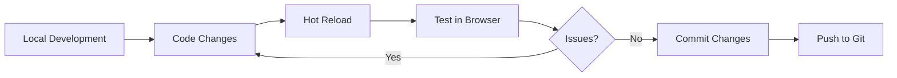
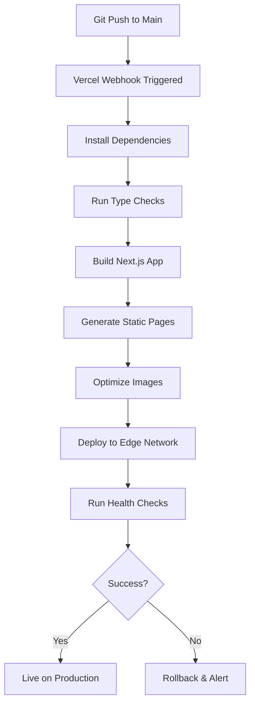
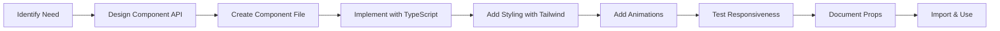
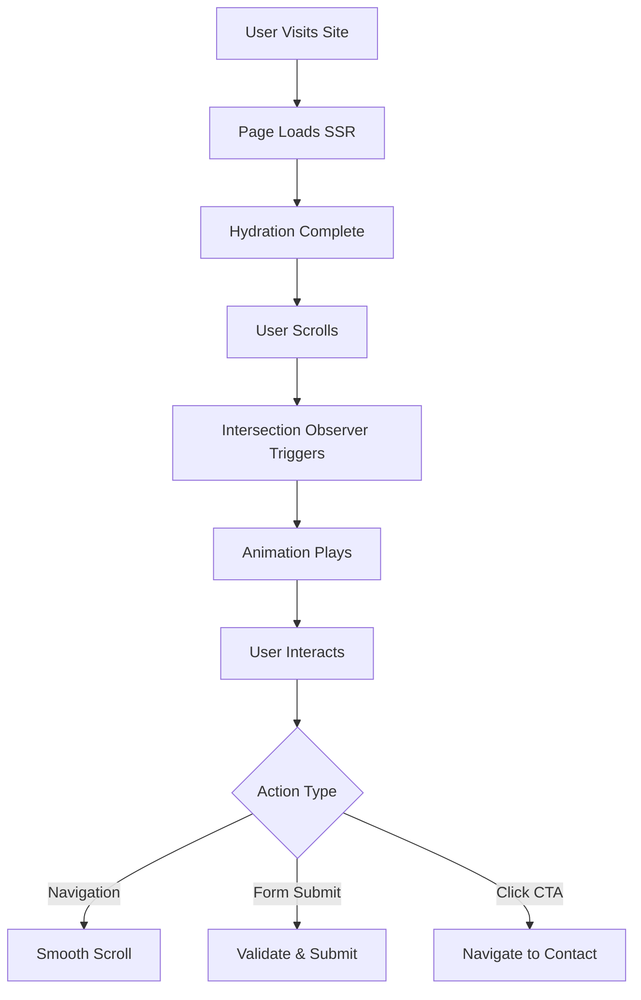
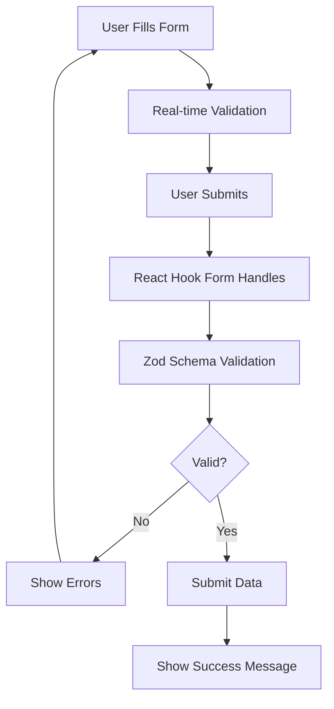

# CodeDale - World-class Tech Partner

<div align="center">


**Trusted by startups and enterprises to design, build, and scale products that perform globally.**

[Live Demo](https://vercel.com/sujayss762-gmailcoms-projects/v0-codedale-frontend-task) • [Documentation](#documentation) • [Architecture](#architecture)

</div>

---

## 📋 Table of Contents

- [Overview](#overview)
- [Key Features](#key-features)
- [Tech Stack](#tech-stack)
- [Architecture](#architecture)
- [Project Structure](#project-structure)
- [Workflows](#workflows)
- [Getting Started](#getting-started)
- [Development](#development)
- [Deployment](#deployment)
- [Services Offered](#services-offered)
- [Skills & Technologies](#skills--technologies)
- [Contributing](#contributing)

---

## 🎯 Overview

CodeDale is a modern, high-performance landing page and portfolio website built with Next.js 16, showcasing world-class tech partnership services. The platform demonstrates expertise in web development, mobile apps, AI solutions, blockchain technology, and more.

The application features:
- 🎨 **Modern UI/UX** with smooth animations and transitions
- ⚡ **Performance-optimized** with Next.js 16 App Router
- 📱 **Fully responsive** design across all devices
- ♿ **Accessible** with ARIA standards
- 🎭 **Interactive components** with Framer Motion and custom animations
- 🌐 **SEO-optimized** for better discoverability

---

## ✨ Key Features

### 🎨 Interactive Sections
- **Hero Section** - Dynamic testimonials with floating cards and dot pattern background
- **Project Showcase** - Animated project cards with hover effects
- **Logo Carousel** - Smooth infinite scrolling partner logos
- **Services Grid** - Visual service offerings with staggered animations
- **Why Choose Us** - Feature cards highlighting competitive advantages
- **Our Works** - Portfolio showcase with project details
- **Achievements** - Milestone tracking with animated counters
- **FAQ Section** - Accordion-based frequently asked questions
- **CTA Section** - Conversion-optimized call-to-action

### 🚀 Performance Features
- Server-side rendering (SSR)
- Static generation for optimal performance
- Image optimization with Next.js Image component
- Code splitting and lazy loading
- Analytics integration with Vercel Analytics

### 🎯 User Experience
- Floating navigation for easy access
- Smooth scroll behavior
- Intersection Observer for scroll animations
- Responsive design patterns
- Form validation with React Hook Form and Zod

---

## 🛠 Tech Stack

### Frontend Framework
- **Next.js 16.0.7** - React framework with App Router
- **React 19.2.0** - UI library
- **TypeScript 5** - Type-safe development

### Styling & UI
- **TailwindCSS 4.1.9** - Utility-first CSS framework
- **Radix UI** - Accessible component primitives
  - Dialog, Dropdown, Accordion, Navigation Menu
  - Toast, Tooltip, Progress, Slider
  - 20+ component primitives
- **class-variance-authority** - Type-safe component variants
- **clsx & tailwind-merge** - Conditional class management
- **Lucide React** - Modern icon library

### Animation & Motion
- **Framer Motion 12.23.25** - Production-ready animation library
- **Embla Carousel** - Lightweight carousel library
- **Custom animations** - Scroll-triggered and intersection-based

### Forms & Validation
- **React Hook Form 7.60.0** - Performant form management
- **Zod 3.25.76** - TypeScript-first schema validation
- **@hookform/resolvers** - Form validation resolvers

### Development Tools
- **pnpm** - Fast, disk space efficient package manager
- **ESLint** - Code linting
- **PostCSS** - CSS processing
- **Autoprefixer** - CSS vendor prefixing

### Deployment & Analytics
- **Vercel** - Deployment platform
- **Vercel Analytics** - Performance monitoring
- **Git** - Version control

---

## 🏗 Architecture

### Application Architecture

```
┌─────────────────────────────────────────────────────────┐
│                     Client Browser                       │
└───────────────────────┬─────────────────────────────────┘
                        │
                        ▼
┌─────────────────────────────────────────────────────────┐
│                   Next.js App Router                     │
│  ┌───────────────────────────────────────────────────┐  │
│  │              Server Components (RSC)              │  │
│  │  - Automatic code splitting                       │  │
│  │  - Streaming SSR                                  │  │
│  │  - Zero client-side JS by default                │  │
│  └───────────────────────────────────────────────────┘  │
│  ┌───────────────────────────────────────────────────┐  │
│  │             Client Components                     │  │
│  │  - Interactive elements                           │  │
│  │  - State management                               │  │
│  │  - Animation & transitions                        │  │
│  └───────────────────────────────────────────────────┘  │
└───────────────────────┬─────────────────────────────────┘
                        │
                        ▼
┌─────────────────────────────────────────────────────────┐
│                  Component Layer                         │
│  ┌─────────────┬──────────────┬─────────────────────┐  │
│  │   Layout    │  UI Library  │   Custom Components │  │
│  │ Components  │ (Radix UI)   │   - Hero            │  │
│  │ - Header    │ - Dialogs    │   - Services        │  │
│  │ - Footer    │ - Accordion  │   - Projects        │  │
│  │ - Nav       │ - Carousel   │   - Testimonials    │  │
│  └─────────────┴──────────────┴─────────────────────┘  │
└───────────────────────┬─────────────────────────────────┘
                        │
                        ▼
┌─────────────────────────────────────────────────────────┐
│                   Utility Layer                          │
│  ┌───────────────┬────────────────┬─────────────────┐  │
│  │   Styling     │   Validation   │    Helpers      │  │
│  │ - TailwindCSS │ - Zod schemas  │ - cn() utility  │  │
│  │ - CVA         │ - Form helpers │ - Date helpers  │  │
│  └───────────────┴────────────────┴─────────────────┘  │
└─────────────────────────────────────────────────────────┘
```

### Component Architecture Pattern

```
┌──────────────────────────────────────────────────┐
│              Page Component (RSC)                │
│  - Data fetching                                 │
│  - Metadata generation                           │
│  - Layout orchestration                          │
└────────────────┬─────────────────────────────────┘
                 │
                 ▼
┌──────────────────────────────────────────────────┐
│          Section Components (Client)             │
│  - User interactions                             │
│  - Animations & transitions                      │
│  - State management                              │
└────────────────┬─────────────────────────────────┘
                 │
                 ▼
┌──────────────────────────────────────────────────┐
│            UI Components (Radix)                 │
│  - Accessible primitives                         │
│  - Composition patterns                          │
│  - Unstyled by default                           │
└────────────────┬─────────────────────────────────┘
                 │
                 ▼
┌──────────────────────────────────────────────────┐
│           Utility Functions                      │
│  - Class merging (cn)                            │
│  - Type utilities                                │
│  - Constants                                      │
└──────────────────────────────────────────────────┘
```

### Data Flow:

```
User Interaction
      │
      ▼
Client Component (useState, useEffect)
      │
      ▼
Event Handlers (onClick, onSubmit)
      │
      ▼
Form Validation (React Hook Form + Zod)
      │
      ▼
State Update / Navigation
      │
      ▼
Re-render with Animation (Framer Motion)
```

---

## 📁 Project Structure

```
codedale/
├── app/                          # Next.js App Router
│   ├── layout.tsx               # Root layout with fonts & metadata
│   ├── page.tsx                 # Home page orchestration
│   ├── globals.css              # Global styles
│   └── contact/                 # Contact route
│       └── page.tsx             # Contact page
│
├── components/                   # React Components
│   ├── ui/                      # Reusable UI primitives (Radix)
│   │   └── button.tsx           # Button component with variants
│   │
│   ├── header.tsx               # Site header with navigation
│   ├── footer.tsx               # Footer component
│   ├── site-footer.tsx          # Enhanced footer
│   ├── floating-nav.tsx         # Floating navigation menu
│   │
│   ├── hero-section.tsx         # Hero with testimonials
│   ├── project-showcase.tsx     # Featured projects
│   ├── logo-carousel.tsx        # Partner logos carousel
│   ├── services.tsx             # Services grid display
│   ├── why-choose-us.tsx        # Feature highlights
│   ├── how-to-get-started.tsx   # Process explanation
│   ├── our-works.tsx            # Portfolio showcase
│   ├── achievements.tsx         # Milestone counters
│   ├── faq.tsx                  # FAQ accordion
│   ├── challenges-section.tsx   # Problem statements
│   ├── cta-section.tsx          # Call-to-action
│   ├── contact-form.tsx         # Contact form with validation
│   │
│   ├── project-card.tsx         # Individual project card
│   ├── custom-icons.tsx         # Custom SVG icons
│   ├── dot-pattern.tsx          # Dot pattern background
│   └── theme-provider.tsx       # Theme context (if needed)
│
├── lib/                          # Utility functions
│   └── utils.ts                 # Helper functions (cn, etc.)
│
├── public/                       # Static assets
│   ├── achievements/            # Achievement images
│   ├── approach/                # Process step images
│   ├── choose/                  # Feature icons
│   ├── hero-icons/              # Hero section icons
│   ├── services/                # Service images
│   └── works/                   # Portfolio images
│
├── styles/                       # Additional styles
│   └── globals.css              # Global CSS imports
│
├── components.json               # Shadcn/ui configuration
├── next.config.mjs              # Next.js configuration
├── tailwind.config.ts           # Tailwind configuration
├── tsconfig.json                # TypeScript configuration
├── postcss.config.mjs           # PostCSS configuration
├── package.json                 # Dependencies & scripts
└── pnpm-lock.yaml               # Lock file
```

---

## 🔄 Workflows

### 1. Development Workflow



**Steps:**
1. Clone repository
2. Install dependencies with `pnpm install`
3. Run dev server with `pnpm dev`
4. Make changes with hot reload
5. Test locally at `localhost:3000`
6. Commit and push changes

### 2. Build & Deployment Workflow



**Automated Process:**
1. Push code to GitHub main branch
2. Vercel detects changes via webhook
3. Runs build process (`next build`)
4. Generates optimized production bundle
5. Deploys to Vercel edge network
6. Goes live automatically

### 3. Component Development Workflow



### 4. User Interaction Workflow



### 5. Form Submission Workflow



---

## 🚀 Getting Started

### Prerequisites

- **Node.js** 18.x or higher
- **pnpm** 8.x or higher (or npm/yarn)
- **Git** for version control

### Installation

1. **Clone the repository**
   ```bash
   git clone https://github.com/yourusername/codedale.git
   cd codedale
   ```

2. **Install dependencies**
   ```bash
   pnpm install
   ```

3. **Run the development server**
   ```bash
   pnpm dev
   ```

4. **Open in browser**
   ```
   http://localhost:3000
   ```

### Available Scripts

```bash
# Development
pnpm dev          # Start dev server on localhost:3000

# Production
pnpm build        # Build optimized production bundle
pnpm start        # Start production server

# Quality
pnpm lint         # Run ESLint for code quality
```

---

## 💻 Development

### Adding New Components

1. Create component in `components/` directory
2. Use TypeScript for type safety
3. Implement with Tailwind CSS classes
4. Add animations with Framer Motion if needed
5. Export and import in page

**Example:**
```typescript
// components/new-component.tsx
"use client"

import { cn } from "@/lib/utils"

interface NewComponentProps {
  title: string
  className?: string
}

export function NewComponent({ title, className }: NewComponentProps) {
  return (
    <div className={cn("p-4", className)}>
      <h2>{title}</h2>
    </div>
  )
}
```

### Styling Guidelines

- Use Tailwind utility classes
- Follow mobile-first responsive design
- Use `cn()` utility for conditional classes
- Maintain consistent spacing scale
- Use design tokens from Tailwind config

### Animation Patterns

- Use `Intersection Observer` for scroll animations
- Implement staggered animations with delays
- Keep animations smooth (300-700ms)
- Use `ease-out` timing for natural motion

---

## 🌐 Deployment

### Vercel (Recommended)

The project is optimized for Vercel deployment:

1. **Connect GitHub repository** to Vercel
2. **Configure build settings:**
   - Framework: Next.js
   - Build Command: `pnpm build`
   - Output Directory: `.next`
3. **Deploy** - Automatic on every push to main

**Live URL:** [https://vercel.com/sujayss762-gmailcoms-projects/v0-codedale-frontend-task](https://vercel.com/sujayss762-gmailcoms-projects/v0-codedale-frontend-task)

### Environment Variables

Currently, the project doesn't require environment variables. If adding backend integration:

```bash
# .env.local
NEXT_PUBLIC_API_URL=your_api_url
```

---

## 🎯 Services Offered

The platform showcases the following services:

1. **Web Development** - Modern, responsive web applications
2. **App Development** - Native and cross-platform mobile apps
3. **AI Applications** - Machine learning and AI-powered solutions
4. **Data Driven Products** - Analytics and data visualization
5. **Blockchain Technology** - Web3 and blockchain solutions
6. **UI/UX Design** - User-centered design and prototyping
7. **Logo Designing** - Brand identity and visual design
8. **Rapid Prototyping & MVPs** - Quick validation and iteration
9. **Digital Marketing & SEO** - Online presence and optimization

---

## 🎓 Skills & Technologies

### Frontend Development
- **React** - Component-based UI development
- **Next.js** - Server-side rendering, routing, optimization
- **TypeScript** - Type-safe development
- **HTML5 & CSS3** - Semantic markup and modern styling
- **Responsive Design** - Mobile-first approach

### Styling & Design
- **TailwindCSS** - Utility-first CSS framework
- **CSS Grid & Flexbox** - Modern layout techniques
- **Animations** - CSS transitions, Framer Motion
- **Design Systems** - Component libraries, Radix UI
- **Accessibility** - WCAG compliance, ARIA standards

### State Management & Forms
- **React Hooks** - useState, useEffect, useRef, custom hooks
- **React Hook Form** - Performant form handling
- **Zod** - Schema validation
- **Intersection Observer API** - Scroll-based triggers

### Performance Optimization
- **Code Splitting** - Dynamic imports
- **Image Optimization** - Next.js Image component
- **Lazy Loading** - On-demand resource loading
- **SSR & SSG** - Server-side and static generation
- **Web Vitals** - Core performance metrics

### Developer Tools
- **Git & GitHub** - Version control
- **pnpm** - Package management
- **ESLint** - Code quality
- **TypeScript** - Type checking
- **VS Code** - Development environment

### Deployment & DevOps
- **Vercel** - Serverless deployment
- **CI/CD** - Automated deployment pipelines
- **Analytics** - Performance monitoring
- **DNS & CDN** - Edge network delivery

### UI/UX Principles
- **User-Centered Design** - Focus on user needs
- **Visual Hierarchy** - Clear information structure
- **Microinteractions** - Engaging user feedback
- **Consistency** - Uniform design patterns
- **Accessibility** - Inclusive design

---

## 📚 Documentation

### Component Documentation

#### Hero Section
- Floating testimonial cards with rotation
- Dot pattern background
- Animated entrance effects
- Responsive layout

#### Services Grid
- 9 service offerings with images
- Staggered animation on scroll
- Hover effects
- Responsive grid layout

#### Form Components
- React Hook Form integration
- Zod schema validation
- Error handling
- Success states

### API Integration (Future)

Currently, the application is frontend-only. To add backend:

```typescript
// Example API integration
async function submitForm(data: FormData) {
  const response = await fetch('/api/contact', {
    method: 'POST',
    headers: { 'Content-Type': 'application/json' },
    body: JSON.stringify(data)
  })
  return response.json()
}
```

---

## 🤝 Contributing

Contributions are welcome! Please follow these steps:

1. Fork the repository
2. Create a feature branch (`git checkout -b feature/amazing-feature`)
3. Commit your changes (`git commit -m 'Add amazing feature'`)
4. Push to the branch (`git push origin feature/amazing-feature`)
5. Open a Pull Request

### Code Standards

- Follow TypeScript best practices
- Use meaningful variable names
- Add comments for complex logic
- Maintain consistent formatting
- Write responsive, accessible code

---

## 📄 License

This project is proprietary and confidential. All rights reserved.

---

## 📞 Contact

For questions or support, please contact:

- **Website:** [CodeDale Live Site](https://vercel.com/sujayss762-gmailcoms-projects/v0-codedale-frontend-task)
- **Email:** contact@codedale.com
- **GitHub:** [Repository](https://github.com/yourusername/codedale)

---

## 🙏 Acknowledgments

- Built with [Next.js](https://nextjs.org/)
- UI components from [Radix UI](https://www.radix-ui.com/)
- Icons from [Lucide](https://lucide.dev/)
- Deployed on [Vercel](https://vercel.com/)
- Initial scaffold from [v0.app](https://v0.app/)

---

<div align="center">

**Made with ❤️ by CodeDale**

*Engineering your digital success*

</div>
